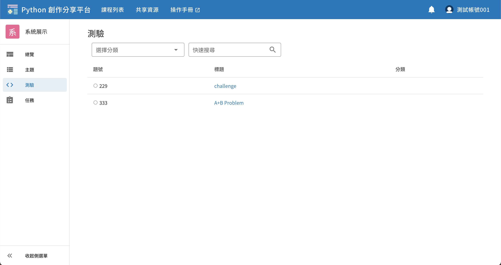
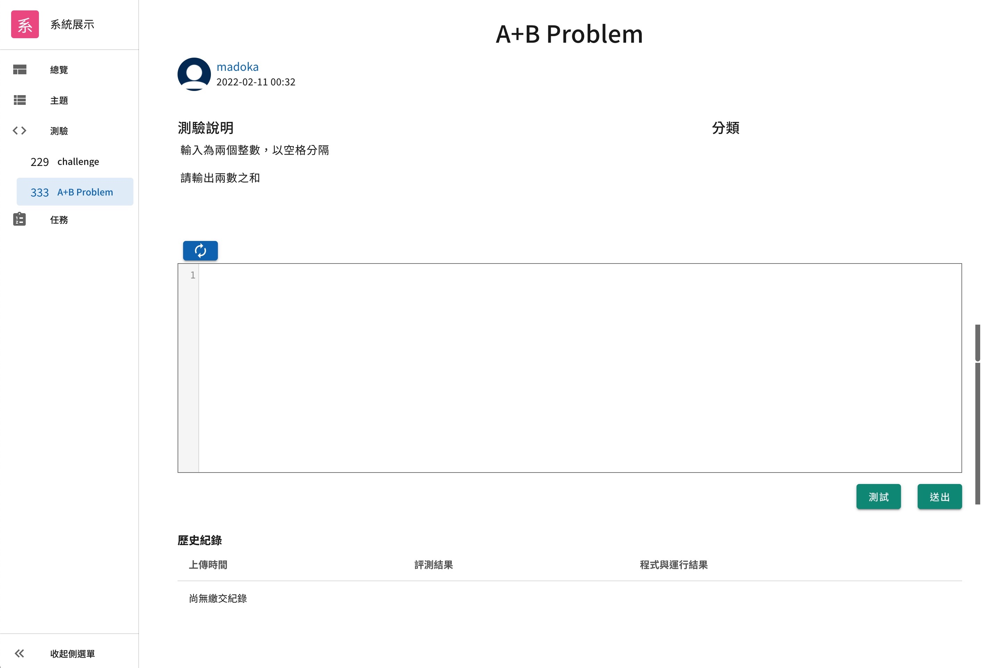

# 於測驗中提交作答

## 測驗列表頁面

從課程中的左側導覽列可以找到「測驗」，點擊後即會來到測驗列表的頁面。



題號左側有一個小的圓形圖示，代表自己該題的作答狀況，有以下三種樣式：

| 樣式                          | 意思                       |
|-----------------------------|--------------------------|
| <status-icon s="n" />空心     | 尚未作答                   |
| <status-icon s="a" />綠色實心 | 已作答且結果正確（Accepted） |
| <status-icon s="w" />紅色實心 | 已作答但結果錯誤           |

> 關於作答的各種結果（如 Accepted, Wrong Answer）之定義，請閱讀 [提交結果](#提交結果)


## 提交作答頁面

從測驗列表中點選題目，即會進入到作答頁面。



撰寫完程式後，可以使用「測試」按鈕來測試程式，測試執行結果**不會保存**。
或進行「送出」即提交正式的 Submission，執行結果會存入資料庫，並可隨時在頁面下方的歷史紀錄查看。


## 提交結果

程式結果包含三個部分：
1. 評測結果，代表使用者的作答結果
2. 標準輸出，使用者的程式標準輸出（Standard Output）
3. 錯誤訊息，使用者的程式標準錯誤（Standard Error）

評測結果可能的值有以下：

| 結果              | 意思                                                                            |
|-------------------|-------------------------------------------------------------------------------|
| Accepted          | 使用者標準輸出與正確答案一致                                                    |
| Wrong Answer      | 使用者標準輸出與正確答案不一致（系統會忽略輸出於行末的多餘空白、檔案末的多餘換行） |
| Time Limit Exceed | 程式運行時間超出時限（目前限制 10 秒）                                            |
| Memory Limit Exceed | 程式運行使用之記憶體超出限制（目前限制 128 MB） ）
| RunTime Error | 程式有語法錯誤或執行時發生例外情形 |

另外，目前輸出大小限制為 4 KB，若超過會直接顯示以下錯誤訊息於「錯誤訊息」中：
```
執行失敗: 輸出大小超過系統限制，無法評測！
```


## 在測驗題型使用多筆測資

若測驗有說明測試方式為**多筆測資**，請以迴圈進行讀取，並捕獲例外情形，例如以下 A+B Problem 的範例：

輸入
```
1 2
3 4
```

輸出
```
3
7
```

作答程式範例
```python
while True:
    try:
        # 在此撰寫作答程式
        a, b = input().split()
        print(int(a) + int(b))
    except:
        # 輸入檔已讀取完畢，捕獲例外情形
        break
```


