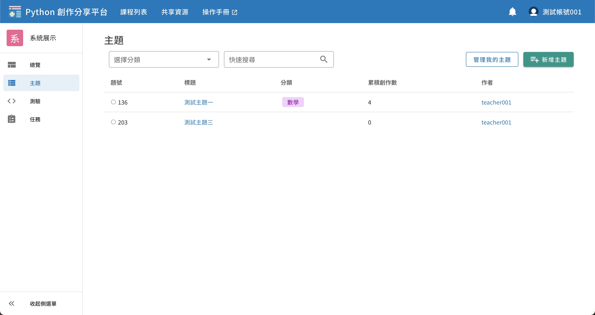
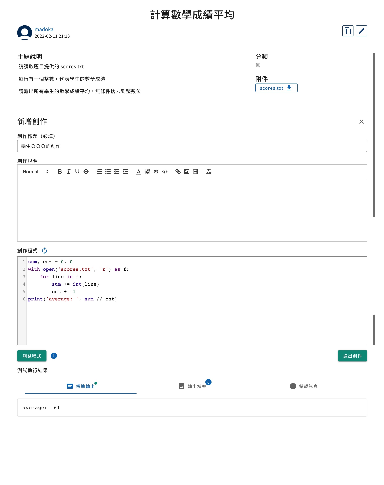

# 於主題中創作


## 主題列表頁面

從課程中的左側導覽列可以找到「測驗」，點擊後即會來到測驗列表的頁面。



題號左側有一個小的圓形圖示，代表自己該題的作答狀況，有以下四種樣式：

| 樣式                          | 意思                              |
|-----------------------------|---------------------------------|
| <status-icon s="n" />空心     | 尚未作答                          |
| <status-icon s="p" />灰色實心 | 已作答，教師尚未批改               |
| <status-icon s="a" />綠色實心 | 已作答且結果被教師批改為 Accepted |
| <status-icon s="w" />紅色實心 | 已作答但結果被教師批改為 Rejected |

> 關於作答的各種結果（如 Accepted, Rejected）之定義，請閱讀 [創作批改](#創作批改)


## 新增創作

從主題列表中點選題目，即會進入到主題頁面。

下方則是所有使用者在此題下發表的創作，右側有「新增創作」的按鈕。



作答者撰寫完程式後，可以使用「測試」按鈕來測試程式，測試執行結果**不會保存**。
或進行「送出」即提交正式的 Submission，執行結果會存入資料庫，並可隨時在頁面下方的歷史紀錄查看。

創作結果包含三個部分：
1. 標準輸出，使用者的程式標準輸出（Standard Output）
2. 輸出檔案，所有使用者在程式寫檔的檔案，圖片會提供縮圖與瀏覽工具，其他檔案類型則需要下載查看。
3. 錯誤訊息，使用者的程式標準錯誤（Standard Error）

**請注意使用 `matplotlib.pyplot` 時應使用 `savefig()` 而非 `show()` 來產出圖表**

另外，目前創作**寫檔**的檔案大小總上限為 64 MB，若超過會直接顯示以下錯誤訊息於「錯誤訊息」中：
```
執行失敗: 輸出檔案大小超過系統限制，無法評測！
```


## 版本控制

創作的標題和說明可以自由更改，而**創作程式每次更改都需以「新增程式版本」來進行**，創作的批改結果是跟隨程式版本，**也就是每個版本都有自己的批改結果**，隨時都可以檢視舊版本。


## 創作批改

創作的狀態由老師進行批改，共有三種狀態

| 狀態     | 意思                  |
|----------|---------------------|
| Pending  | 創作已繳交，等待批改中 |
| Accepted | 教師核可了創作        |
| Rejected | 教師駁回了創作        |

