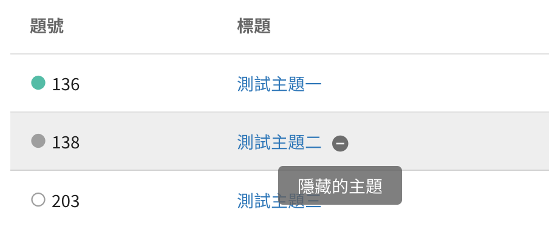
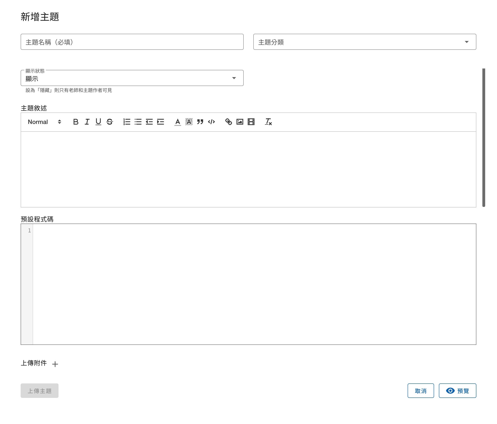

# 發表主題

新增主題有以下欄位：
- 主題名稱：必填，可包含中英文數字等可顯示字元，主題名稱可重複。
- 主題分類：將於主題列表中顯示此題有哪些分類，使用者可以透過分類搜尋主題。
- 顯示狀態：可調整「顯示」或「隱藏」，若設定為隱藏則只有自己和教師可見，其他同學的主題列表中將不會出現此主題。
> 
> 
> 自己在測驗列表會看見隱藏的測驗，其名稱右邊有圖示，滑鼠懸浮在上會提示此題為「隱藏的測驗」。
- 主題敘述：此題的題目敘述，供作答者閱讀。
- 預設程式碼：使用者在新增創作時，系統將會自動帶入這段預設程式碼到程式編輯區，成為使用者的 Template。注意此段程式碼**可以被使用者自行移除**，無法強制使用者必須包含這段程式碼才可提交創作。
- 上傳附件：可上傳任意數量的檔案，這些檔案能夠在創作中讀取，讀取附件的路徑為**當前目錄**。

