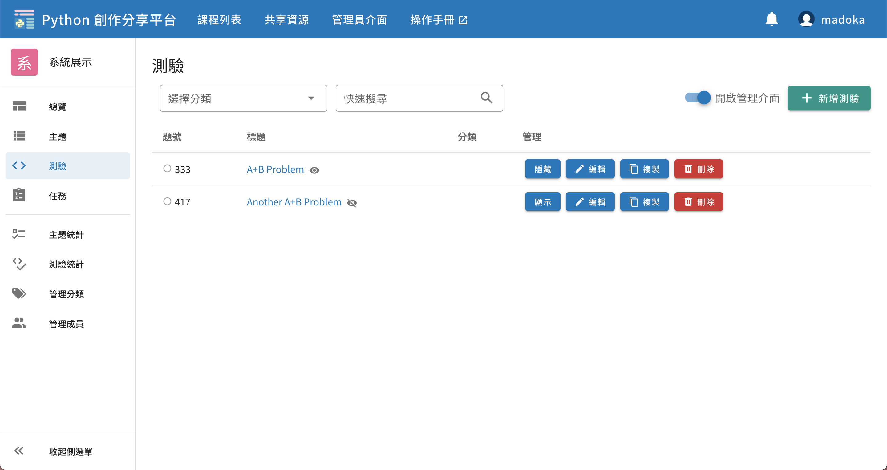

# 測驗


固定輸入輸出的程式練習，線上進行即時批改，類似 Online Judge 的題目。

例如基本的「數學運算」、「字串處理」、「迴圈與陣列」等語法題，教師可以透過創立測驗題型，提供題目的**標準輸入（Standard Input）**和**標準輸出（Standard Output）**，學生上傳程式碼後，系統將會執行學生程式並帶入教師給定的標準輸入，比較學生程式的輸出是否與標準輸出一致，並給予學生批改結果（如 Accepted 輸出正確、Wrong Answer 輸出錯誤等）。

[範例（需登入）](https://pyshare.noj.tw/course/605a1ef29060c7c239d0548a/challenge/333)


## 測驗列表頁面

從課程中的左側導覽列可以找到「測驗」，點擊後即會來到測驗列表的頁面。


右上角有兩個功能按鈕，**僅有該課程的教師可見**：
- 開啟管理介面：此開關決定是否顯示管理功能的 UI，管理功能請見下方 [測驗管理](#測驗管理)。
- 新增測驗：連結到新增測驗的頁面，新增功能請見下方 [新增測驗](#新增測驗)。

題號左側有一個圓形圖示，是提供給學生查看自己該題的作答狀況，有以下三種樣式：

| 樣式                          | 意思                                  |
|-----------------------------|-------------------------------------|
| <status-icon s="n" />空心     | 尚未作答                              |
| <status-icon s="a" />綠色實心 | 已作答且結果正確（Accepted）            |
| <status-icon s="w" />紅色實心 | 已作答但結果錯誤（Accepted 以外的結果） |

> 關於作答的各種結果（如 Accepted, Wrong Answer）之定義，請閱讀 [提交結果](#提交結果)


## 新增測驗

新增測驗有以下欄位（粗體為重要功能，其餘可以略過）：
1. **測驗名稱**：必填，可包含中英文數字等可顯示字元，不同測驗有相同名稱是允許的。
2. 測驗分類：將於測驗列表中顯示此題有哪些分類，使用者可以透過分類搜尋測驗。
3. 顯示狀態：可調整「顯示」或「隱藏」，設定為隱藏則只有教師可見，學生的測驗列表中不會出現。
4. 發布至共享資源：勾選後，此題會出現於[共享資源](/guide/teacher-share)，開放其他教師複製到他們的課程中使用。
5. **測驗敘述**：此題的題目敘述，供作答者閱讀。
6. 預設程式碼：將會自動帶入這段預設程式碼到作答者的程式編輯區，成為作答者的 Template。此段程式碼可以被作答者自行移除，無法強制作答者必須包含這段程式碼才可提交作答。
7. **上傳輸入輸出檔**：各一個純文字檔，輸入將作為學生程式的標準輸入，輸出將與學生程式產生輸出做比對，以產生作答結果。


## 提交作答頁面

從測驗列表中點選題目，即會進入到作答頁面，右上角有兩顆功能按鈕，**僅有該課程的教師可見**
- 拷貝圖示：可以複製此題目，到自己擁有的其他課程或目前的課程。
- 鉛筆圖示：前往編輯此題


作答者撰寫完程式後，可以使用「測試」按鈕來測試程式，測試執行結果不會保存。
或進行「送出」即提交正式的 Submission，執行結果會存入資料庫，並可隨時在頁面下方的歷史紀錄查看。
> 目前測試和送出都會使用教師提供的輸入輸出檔，未來預計將測試更改為自訂輸入輸出。


## 提交結果

程式結果包含三個部分：
1. 評測結果，代表使用者的作答結果
2. 標準輸出，使用者的程式標準輸出（Standard Output）
3. 錯誤訊息，使用者的程式標準錯誤（Standard Error）

評測結果可能的值有以下：

| 結果              | 意思                                                                            |
|-------------------|-------------------------------------------------------------------------------|
| Accepted          | 使用者標準輸出與正確答案一致                                                    |
| Wrong Answer      | 使用者標準輸出與正確答案不一致（系統會忽略輸出於行末的多餘空白、檔案末的多餘換行） |
| Time Limit Exceed | 程式運行時間超出時限（目前限制 10 秒）                                            |
| Memory Limit Exceed | 程式運行使用之記憶體超出限制（目前限制 128 MB）
| Runtime Error | 程式有語法錯誤或執行時發生例外情形 |

另外，目前輸出大小限制為 4 KB，若超過會直接顯示以下錯誤訊息於「錯誤訊息」中：
```
執行失敗: 輸出大小超過系統限制，無法評測！
```


## 在測驗題型使用多筆測資

目前平台尚只支援上傳輸入檔與輸出檔**各一個**，若需要多筆測資，一個方法是將所有輸入合併成一個檔案，輸出亦然，並請作答者用迴圈進行讀取，例如以下 A+B Problem 的範例：

input.txt
```
1 2
3 4
```

output.txt
```
3
7
```

作答程式範例
```python
while True:
    try:
        # 在此撰寫作答程式
        a, b = input().split()
        print(int(a) + int(b))
    except:
        # 輸入檔已讀取完畢，捕獲例外情形
        break
```


## 測驗管理

開啟右上角「管理我的測驗」後，將會顯示管理相關功能的 UI，包含四個按鈕：
- 隱藏/顯示：點擊後將切換此測驗的顯示狀態，設為隱藏或顯示。
- 編輯：點擊後進入編輯頁面。
- 複製：點擊後會詢問您欲將此測驗複製至哪個課程，亦可選擇當前課程。
- 刪除：點擊後會詢問您是否刪除此測驗，確認刪除動作後即刪除。


