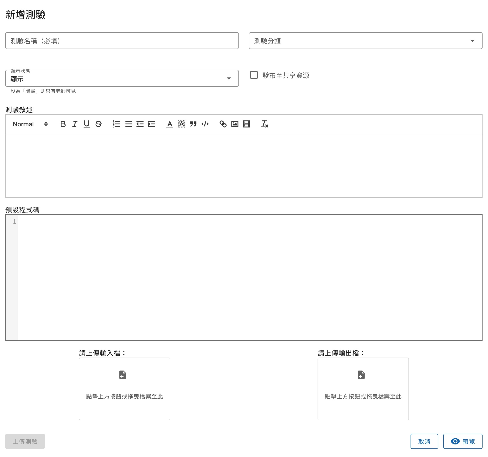

# 測驗

## 測驗列表頁面

從課程中的左側導覽列可以找到「測驗」，點擊後即會來到測驗列表的頁面。


右上角有三顆功能按鈕，**僅有該課程的教師可見**
- 檢視測驗統計：連結到[測驗統計](/guide/teacher-course##測驗統計)頁面，可檢視學生的作答情況。
- 管理我的測驗：連結到[測驗管理](/guide/teacher-course##測驗管理)頁面，該頁面提供編輯、刪除測驗的功能。
- 新增測驗：連結到[新增測驗](#新增測驗)頁面。

題號左側有一個小的圓形圖示，是提供給**學生**查看自己該題的作答狀況，有以下三種樣式：

| 樣式                          | 意思                       |
|-----------------------------|--------------------------|
| <status-icon s="n" />空心     | 尚未作答                   |
| <status-icon s="a" />綠色實心 | 已作答且結果正確（Accepted） |
| <status-icon s="w" />紅色實心 | 已作答但結果錯誤           |

> 關於作答的各種結果（如 Accepted, Wrong Answer）之定義，請閱讀 [提交結果](#提交結果)


## 新增測驗

新增測驗有以下欄位：
- 測驗名稱：必填，可包含中英文數字等可顯示字元，測驗名稱可重複。
- 測驗分類：將於測驗列表中顯示此題有哪些分類，使用者可以透過分類搜尋測驗。
- 顯示狀態：可調整「顯示」或「隱藏」，若設定為隱藏則只有教師可見，學生的測驗列表中將不會出現。
> 
> 
> 教師在測驗列表會看見隱藏的測驗，其名稱右邊有圖示，滑鼠懸浮在上會提示此題為「隱藏的測驗」。
- 發布至共享資源：勾選後，此題會出現於[共享資源](/guide/teacher-share)，開放其他教師複製到他們的課程中使用。
- 測驗敘述：此題的題目敘述，供作答者閱讀。
- 預設程式碼：將會自動帶入這段預設程式碼到作 答者的程式編輯區，成為作答者的 Template。注意此段程式碼**可以被作答者自行移除**，無法強制作答者必須包含這段程式碼才可提交作答。
- 上傳輸入輸出檔：各一個純文字檔，輸入將作為程式的標準輸入，輸出將與程式運行後產生的標準輸出比對來產生作答結果。




## 提交作答頁面

從測驗列表中點選題目，即會進入到作答頁面，右上角有兩顆功能按鈕，**僅有該課程的教師可見**
- 拷貝圖示：可以複製此題目，到自己擁有的其他課程或目前的課程。
- 鉛筆圖示：前往編輯此題


作答者撰寫完程式後，可以使用「測試」按鈕來測試程式，測試執行結果**不會保存**。
或進行「送出」即提交正式的 Submission，執行結果會存入資料庫，並可隨時在頁面下方的歷史紀錄查看。
> 目前測試和送出都會使用教師提供的輸入輸出檔，未來預計將測試更改為自訂輸入輸出。


## 提交結果

程式結果包含三個部分：
1. 評測結果，代表使用者的作答結果
2. 標準輸出，使用者的程式標準輸出（Standard Output）
3. 錯誤訊息，使用者的程式標準錯誤（Standard Error）

評測結果可能的值有以下：

| 結果              | 意思                                                                            |
|-------------------|-------------------------------------------------------------------------------|
| Accepted          | 使用者標準輸出與正確答案一致                                                    |
| Wrong Answer      | 使用者標準輸出與正確答案不一致（系統會忽略輸出於行末的多餘空白、檔案末的多餘換行） |
| Time Limit Exceed | 程式運行時間超出時限（目前限制 10 秒）                                            |
| Memory Limit Exceed | 程式運行使用之記憶體超出限制（目前限制 128 MB） ）
| RunTime Error | 程式有語法錯誤或執行時發生例外情形 |

另外，目前輸出大小限制為 4 KB，若超過會直接顯示以下錯誤訊息於「錯誤訊息」中：
```
執行失敗: 輸出大小超過系統限制，無法評測！
```


## 在測驗題型使用多筆測資

目前平台尚只支援上傳輸入檔與輸出檔**各一個**，若需要多筆測資，一個方法是將所有輸入合併成一個檔案，輸出亦然，並請作答者用迴圈進行讀取，例如以下 A+B Problem 的範例：

input.txt
```
1 2
3 4
```

output.txt
```
3
7
```

作答程式範例
```python
while True:
    try:
        # 在此撰寫作答程式
        a, b = input().split()
        print(int(a) + int(b))
    except:
        # 輸入檔已讀取完畢，捕獲例外情形
        break
```


