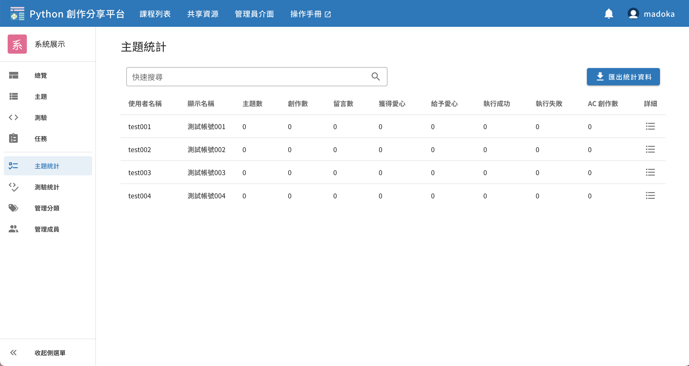
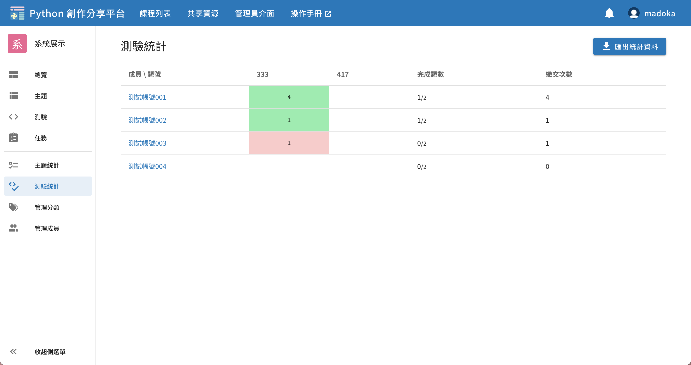
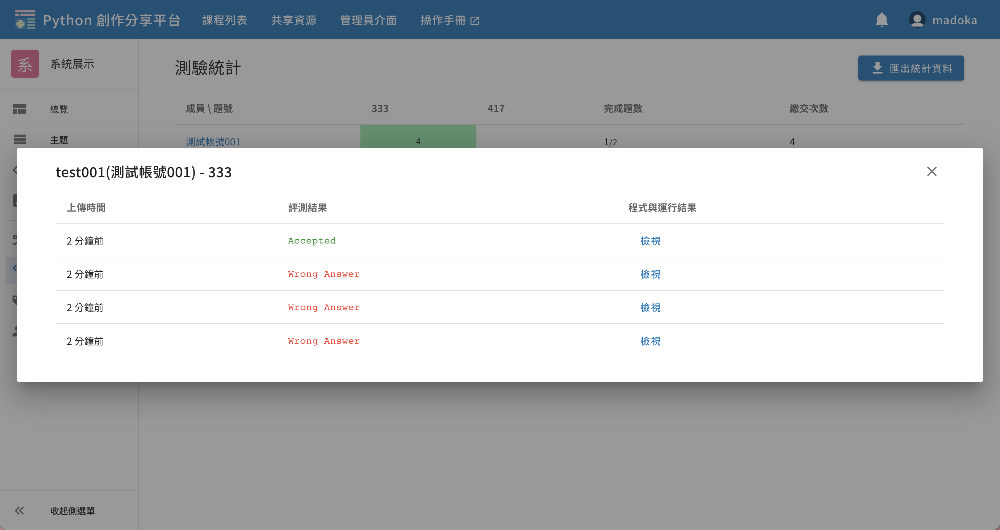
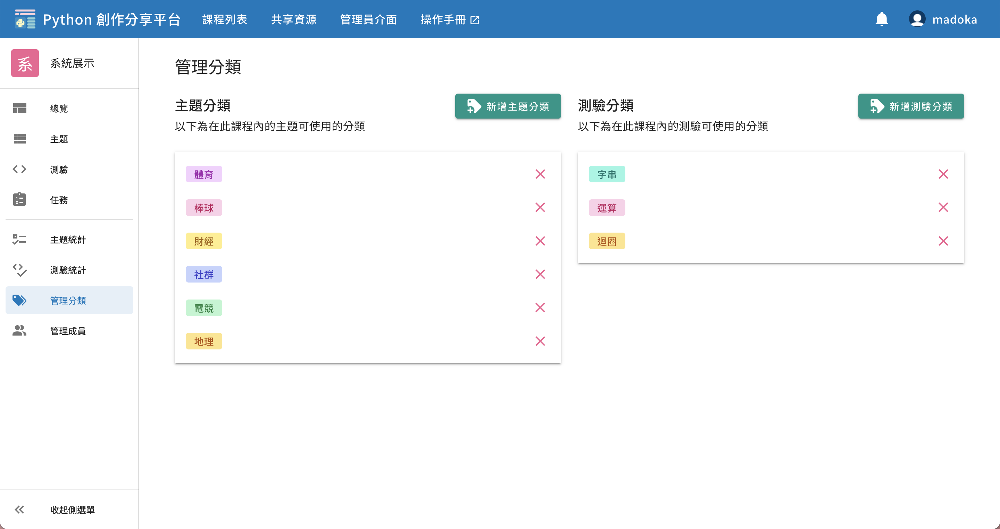
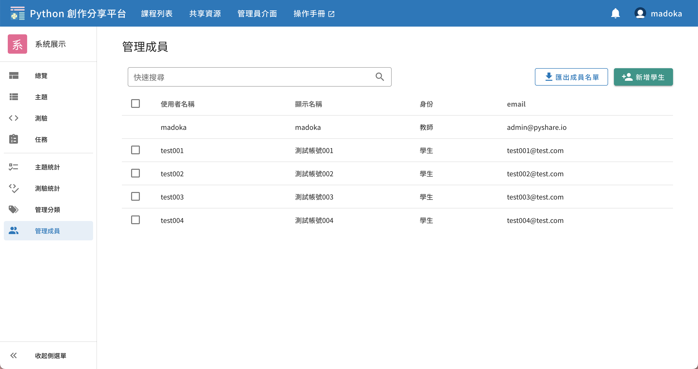

# 課程管理

## 主題統計

點入左側欄的主題統計進入，可以瀏覽學生在主題與創作相關的數據，亦可匯出 CSV。

## 測驗統計

點入左側欄的測驗統計進入，可以瀏覽學生在測驗作答相關的數據，亦可匯出 CSV。

方塊上的數字代表繳交程式的次數，綠色是通過，紅色是未通過，其餘為未作答。

點擊方塊可以瀏覽學生詳細的作答記錄，可檢視每次作答記錄的程式碼。

## 管理分類

透過此頁面管理供「主題」、「測驗」使用的分類。

## 管理成員

透過此頁面新增、刪除學生，亦可匯出學生名單。

