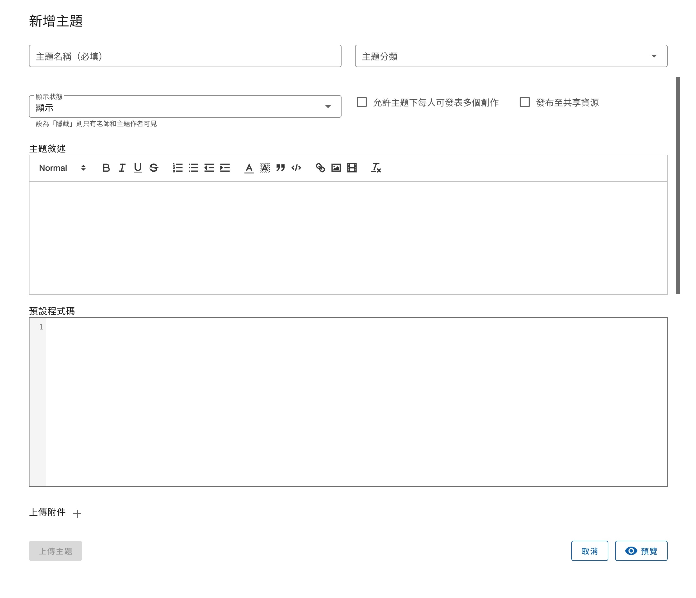

# 主題與創作

## 主題列表頁面

從課程中的左側導覽列可以找到「測驗」，點擊後即會來到測驗列表的頁面。


右上角有三顆功能按鈕，**僅有該課程的教師可見**
- 檢視主題統計：連結到[主題統計](#)頁面，可檢視學生的作答情況。
- 管理我的主題：連結到[主題管理](#)頁面，該頁面提供編輯、刪除主題的功能。
- 新增主題：連結到[新增主題](#新增主題)頁面。

題號左側有一個小的圓形圖示，是提供給**學生**查看自己該題的作答狀況，有以下三種樣式：

| 樣式                          | 意思                              |
|-----------------------------|---------------------------------|
| <status-icon s="n" />空心     | 尚未作答                          |
| <status-icon s="p" />灰色實心 | 已作答，教師尚未批改               |
| <status-icon s="a" />綠色實心 | 已作答且結果被教師批改為 Accepted |
| <status-icon s="w" />紅色實心 | 已作答但結果被教師批改為 Rejected |

> 關於作答的各種結果（如 Accepted, Rejected）之定義，請閱讀 [創作批改](#創作批改)


## 新增主題

新增主題有以下欄位：
- 主題名稱：必填，可包含中英文數字等可顯示字元，主題名稱可重複。
- 主題分類：將於主題列表中顯示此題有哪些分類，使用者可以透過分類搜尋主題。
- 顯示狀態：可調整「顯示」或「隱藏」，若設定為隱藏則只有教師可見，學生的主題列表中將不會出現。
> 
> 
> 教師在測驗列表會看見隱藏的測驗，其名稱右邊有圖示，滑鼠懸浮在上會提示此題為「隱藏的測驗」。
- 允許主題下每人可發表多個創作：預設使用者只能在一主題下發表一個創作，若勾選此選項則移除此限制。
- 發布至共享資源：勾選後，此題會出現於[共享資源](/guide/teacher-share)，開放其他教師複製到他們的課程中使用。
- 主題敘述：此題的題目敘述，供作答者閱讀。
- 預設程式碼：將會自動帶入這段預設程式碼到作 答者的程式編輯區，成為作答者的 Template。注意此段程式碼**可以被作答者自行移除**，無法強制作答者必須包含這段程式碼才可提交作答。
- 上傳附件：可上傳任意數量的檔案，這些檔案能夠在創作中讀取，讀取附件的路徑為**當前目錄**。




## 新增創作

從主題列表中點選題目，即會進入到主題頁面，右上角有兩顆功能按鈕，**僅有該課程的教師可見**
- 拷貝圖示：可以複製此題目，到自己擁有的其他課程或目前的課程。
- 鉛筆圖示：前往編輯此題

下方則是所有使用者在此題下發表的創作，右側有「新增創作」的按鈕。


作答者撰寫完程式後，可以使用「測試」按鈕來測試程式，測試執行結果**不會保存**。
或進行「送出」即提交正式的 Submission，執行結果會存入資料庫，並可隨時在頁面下方的歷史紀錄查看。


## 創作批改

創作結果包含三個部分：
1. 標準輸出，使用者的程式標準輸出（Standard Output）
2. 輸出檔案，所有使用者在程式寫檔的檔案，圖片會提供縮圖與瀏覽工具，其他檔案類型則需要下載查看。
3. 錯誤訊息，使用者的程式標準錯誤（Standard Error）

**請注意使用 `matplotlib.pyplot` 時應使用 `savefig()` 而非 `show()` 來產出圖表**

創作的狀態

| 結果     | 意思 |
|----------|------|
| Pending  |      |
| Accepted |      |
| Rejected |      |

另外，目前創作**寫檔**的檔案大小總上限為 64 MB，若超過會直接顯示以下錯誤訊息於「錯誤訊息」中：
```
執行失敗: 輸出檔案大小超過系統限制，無法評測！
```
