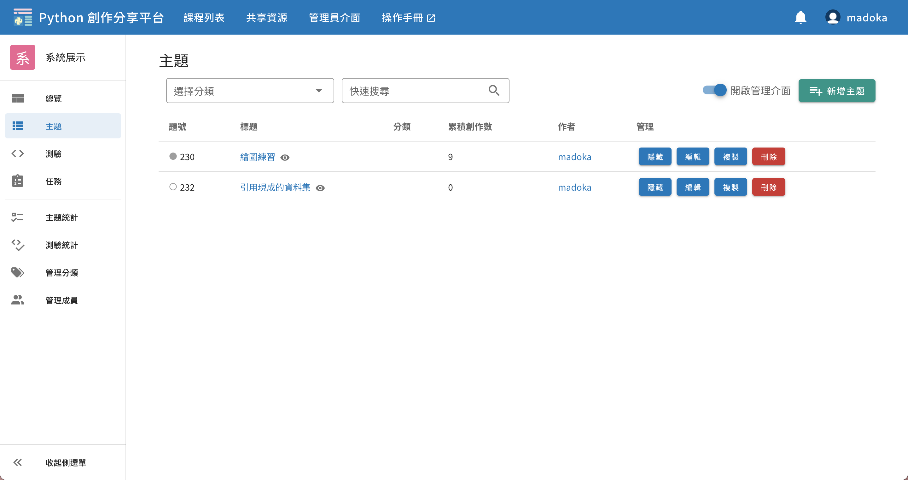

# 主題與創作


可附帶資料集的主題/留言式討論區，留言中支援提交可讀取資料集的程式碼，系統會自動執行並輸出文字或圖表。

例如「檔案處理」、「資料處理統計」、「資料視覺化」等較難固定正確答案的開放題型，教師可以透過創立主題題型，提供資料集（CSV、文字檔、圖片檔或其他），學生撰寫的程式可讀寫檔案。

另外，學生亦可發表主題。

[範例（需登入）](https://pyshare.noj.tw/course/605a1ef29060c7c239d0548a/problem/230)

## 主題列表頁面

從課程中的左側導覽列可以找到「測驗」，點擊後即會來到測驗列表的頁面。


右上角有兩個功能按鈕，**僅有該課程的教師可見**：
- 開啟管理介面：此開關決定是否顯示管理功能的 UI，管理功能請見下方 [主題管理](#主題管理)。
- 新增主題：連結到新增主題的頁面，新增功能請見下方 [新增主題](#新增主題)。

題號左側有一個小的圓形圖示，是提供給**學生**查看自己該題的作答狀況，有以下四種樣式：

| 樣式                          | 意思                              |
|-----------------------------|---------------------------------|
| <status-icon s="n" />空心     | 尚未作答                          |
| <status-icon s="p" />灰色實心 | 已作答，教師尚未批改               |
| <status-icon s="a" />綠色實心 | 已作答且結果被教師批改為 Accepted |
| <status-icon s="w" />紅色實心 | 已作答但結果被教師批改為 Rejected |

> 關於作答的各種結果（如 Accepted, Rejected）之定義，請閱讀 [創作批改](#創作批改)


## 新增主題

新增主題有以下欄位（粗體為重要功能，其餘可以略過）：
1. **主題名稱**：必填，可包含中英文數字等可顯示字元，不同主題有相同名稱是允許的。
2. 主題分類：將於主題列表中顯示此題有哪些分類，使用者可以透過分類搜尋主題。
3. 顯示狀態：可調整「顯示」或「隱藏」，設定為隱藏則只有教師和作者可見，學生的測驗列表中不會出現。
4. 允許主題下每人可發表多個創作：預設使用者只能在一主題下發表一個創作，若勾選此選項則移除此限制。
5. 發布至共享資源：勾選後，此題會出現於[共享資源](/guide/teacher-share)，開放其他教師複製到他們的課程中使用。
6. **主題敘述**：此題的題目敘述，供作答者閱讀。
7. 預設程式碼：使用者在新增創作時，系統將會自動帶入這段預設程式碼到程式編輯區，成為使用者的 Template。此段程式碼可以被使用者自行移除，無法強制使用者必須包含這段程式碼才可提交創作。
8. **上傳附件**：可上傳任意數量的檔案，這些檔案能夠在創作的程式中讀取，讀取附件的路徑為**當前目錄**。


## 學生的主題

在平台中，學生亦可建立主題，例如可應用於專題報告的場景，學生新增主題的方式與老師大致相同，但沒有「允許主題下每人可發表多個創作」以及「發布至共享資源」這兩個選項，詳細可以閱讀學生視角的[發表主題](/guide/student-problem)。

另外，學生若發表**隱藏**的主題，老師亦可在主題列表中看見。


## 新增創作

從主題列表中點選題目，即會進入到主題頁面，右上角有兩顆功能按鈕，**僅有該課程的教師可見**
- 拷貝圖示：可以複製此題目，到自己擁有的其他課程或目前的課程。
- 鉛筆圖示：前往編輯此題

下方則是所有使用者在此題下發表的創作，右側有「新增創作」的按鈕。


作答者撰寫完程式後，可以使用「測試」按鈕來測試程式，測試執行結果**不會保存**。
或進行「送出」即提交正式的 Submission，執行結果會存入資料庫，並可隨時在頁面下方的歷史紀錄查看。

創作結果包含三個部分：
1. 標準輸出，使用者的程式標準輸出（Standard Output）
2. 輸出檔案，使用者在程式寫檔的檔案，圖片會提供縮圖與瀏覽工具，其他檔案類型則需要下載查看。
3. 錯誤訊息，使用者的程式標準錯誤（Standard Error）

**請注意使用 `matplotlib.pyplot` 時應使用 `savefig()` 而非 `show()` 來產出圖表**

另外，目前創作**寫檔**的檔案大小總上限為 64 MB，若超過會直接顯示以下錯誤訊息於「錯誤訊息」中：
```
執行失敗: 輸出檔案大小超過系統限制，無法評測！
```


## 版本控制

創作的標題和說明可以自由更改，而**創作程式每次更改都需以「新增程式版本」來進行**，創作的批改結果是跟隨程式版本，**也就是每個版本都有自己的批改結果**，隨時都可以檢視舊版本。


## 創作批改

創作的狀態由老師進行批改，共有三種狀態

| 狀態     | 意思                  |
|----------|---------------------|
| Pending  | 創作已繳交，等待批改中 |
| Accepted | 教師核可了創作        |
| Rejected | 教師駁回了創作        |

點進學生的創作後，即可在選單選擇欲批改的狀態，可以隨時更改，亦可批改任何版本的創作程式。


## 主題管理

開啟右上角「管理我的主題」後，將會顯示管理相關功能的 UI，包含四個按鈕：
- 隱藏/顯示：點擊後將切換此主題的顯示狀態，設為隱藏或顯示。
- 編輯：點擊後進入編輯頁面。
- 複製：點擊後會詢問您欲將此主題複製至哪個課程，亦可選擇當前課程。
- 刪除：點擊後會詢問您是否刪除此主題，確認刪除動作後即刪除。


