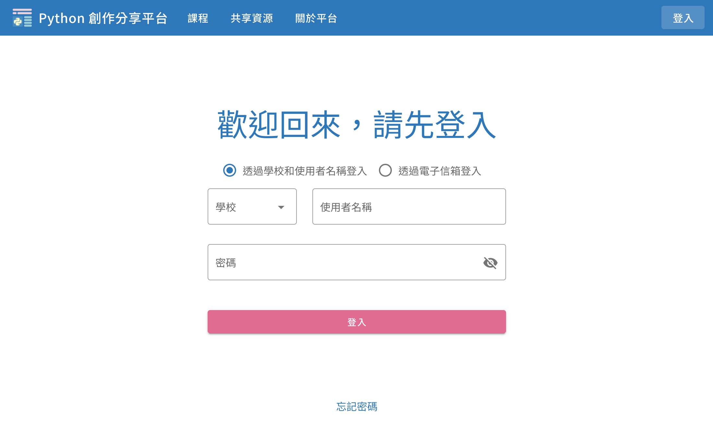
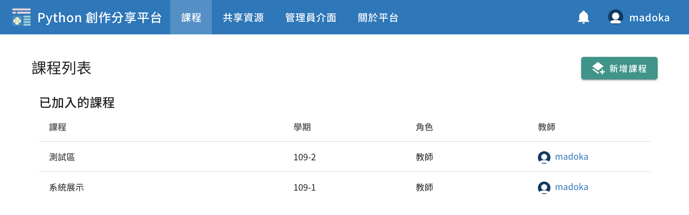
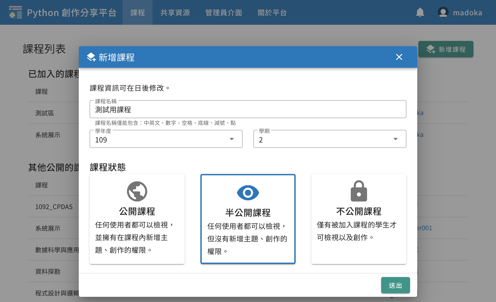
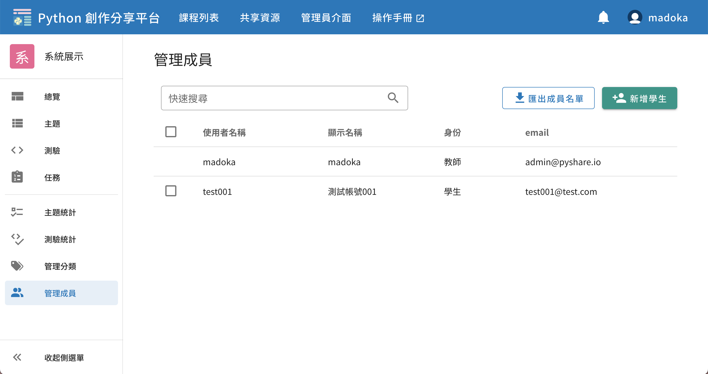
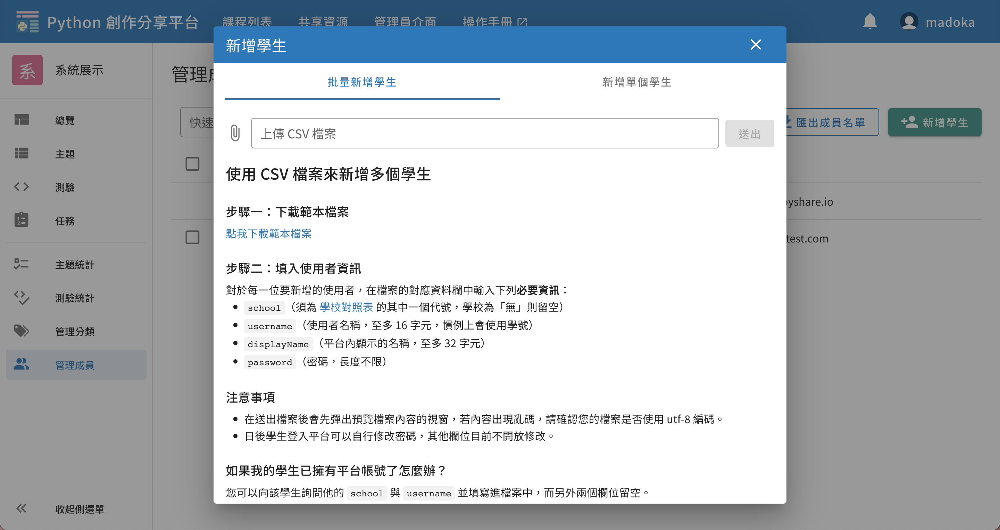

# 快速上手

我們將說明如何從零開始快速打造一個可使用的課程，共有五個步驟：

## 一、登入
申請一個教師帳號，登入平台

若您尚無帳號，請來信聯絡計畫主持人：國立臺灣師範大學資工系蔣宗哲副教授

電子信箱：[`tcchiang@ntnu.edu.tw`](mailto:tcchiang@ntnu.edu.tw)。

## 二、新增課程入口
從上方導覽列進入「課程列表」，點擊右上角「新增課程」按鈕

## 三、新增課程表單
填寫課程所需資料，選擇課程權限，送出即可新開課程

## 四、新增學生入口
進入新開設的課程，從左方導覽列進入「管理成員」，點擊右上角「新增學生」按鈕。

## 五、新增學生表單
根據指示新增學生到課程中

## 大功告成！

在後面的章節，我們將詳細說明「測驗」、「主題」以及「課程管理」的詳細使用方法。
