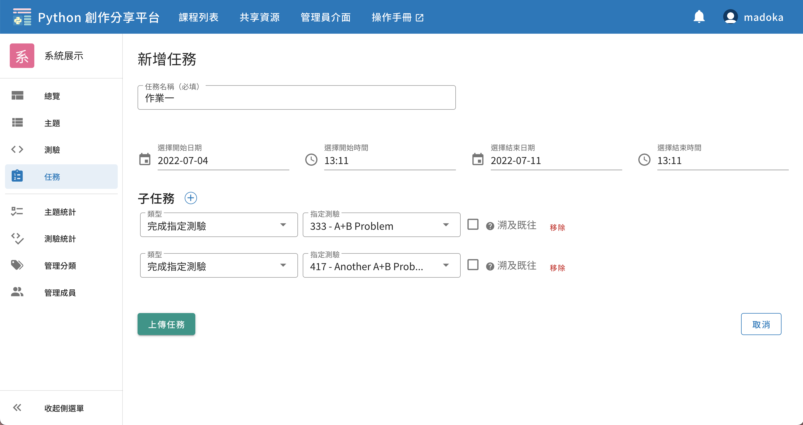

# 任務系統

課程中若已建立了許多題目，需要集合一些題目作為作業給學生去完成時，可以使用任務系統。

新增任務所需要的欄位有
1. 任務名稱
2. 開始時間
3. 結束時間
4. 子任務

子任務有四種：
1. 完成指定測驗：任務目標是學生在指定的測驗中得到 AC
2. 建立創作：任務目標是學生在指定的主題中建立創作
3. 於創作下留言：任務目標是學生在任意創作下發表留言
4. 於創作按愛心：任務目標是學生在任意創作下給予愛心

若在新增子任務時勾選一旁的溯及既往，將會「一次性」地將開始時間前的繳交紀錄也計算進來。需注意此選項在任務開始時間**晚於**現在時是沒有效果的。

成功新增任務後，即可在任務面板看到該任務的內容以及學生的作答狀況，並可匯出統計資料。

